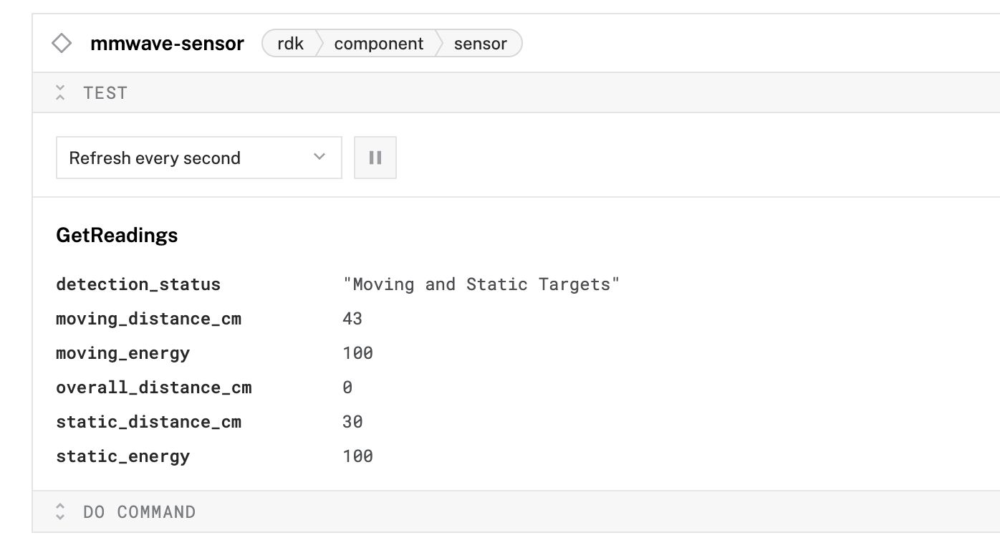

# Module mmwave

The `mmwave` module uses the `joyce:mmwave:mmwave` model to get readings from the LD2410C mmwave sensor.

### Configuration

To add the sensor component to your Viam machine:

- Add a component > sensor > `mmwave`.
- **Save** your changes in the Viam app, and wait a moment for the configuration to update.
- Wait a moment for the serial port to initialize at `/dev/ttyUSB0`, with baud rate `256000`, for the radar to initialize.
- Expand the **TEST** section of the component in the Viam app to see the results of `getReadings`.
  

No additional configuration is required for this model.
